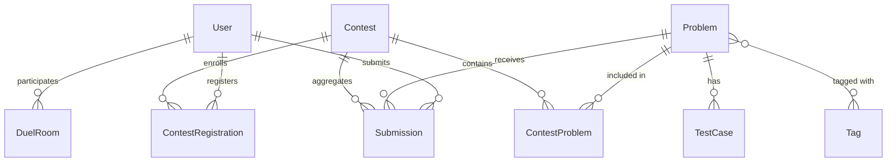
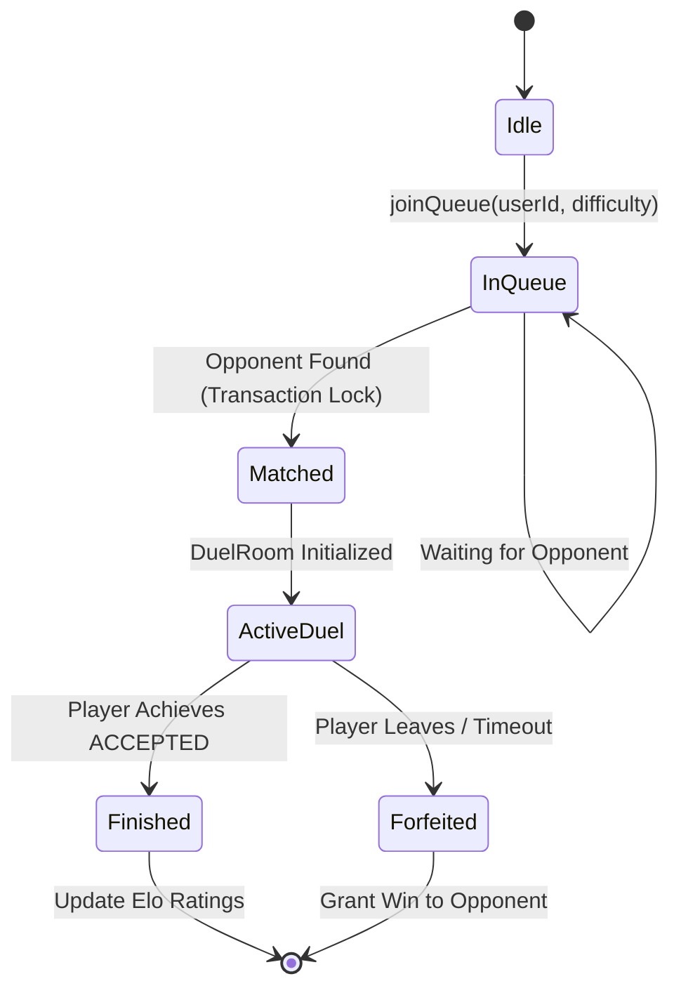

# UMMEED PLATFORM — COMPLETE SYSTEM ARCHITECTURE & ENGINEERING HANDBOOK
**Version:** 3.2.0  
**Target Scale:** 50 – 100 Concurrent Active Users (with 10k Scale Outlines)  
**Author:** Staff System Architect & Core Engineering Team  
**Platform URL:** [https://ummeedcodelab.duckdns.org](https://ummeedcodelab.duckdns.org)  

---

## TABLE OF CONTENTS
1. [Executive Summary & Platform Mission](#1-executive-summary--platform-mission)
2. [Complete System Topology & Infrastructure Blueprint](#2-complete-system-topology--infrastructure-blueprint)
3. [End-to-End Request Lifecycle & Networking Architecture](#3-end-to-end-request-lifecycle--networking-architecture)
4. [Database Schema & Data Dictionary](#4-database-schema--data-dictionary)
5. [Problem Authoring, Storage, & On-The-Fly Dynamic Boilerplate Engine](#5-problem-authoring-storage--on-the-fly-dynamic-boilerplate-engine)
6. [Execution Sandbox & Judge0 Compilation Pipeline](#6-execution-sandbox--judge0-compilation-pipeline)
7. [Real-Time 1v1 Code Duels & Matchmaking State Machine](#7-real-time-1v1-code-duels--matchmaking-state-machine)
8. [Contest Engine, Live Leaderboard & ICPC Scoring](#8-contest-engine-live-leaderboard--icpc-scoring)
9. [Authentication, RBAC & Security Posture](#9-authentication-rbac--security-posture)
10. [AI-Powered Tutor & Hint System (Google Gemini API)](#10-ai-powered-tutor--hint-system-google-gemini-api)
11. [Admin Operations & Dynamic Problem Synchronization](#11-admin-operations--dynamic-problem-synchronization)
12. [DevOps, SSL, PM2, & Server Maintenance Manual](#12-devops-ssl-pm2--server-maintenance-manual)
13. [Complete API Reference & Data Contracts](#13-complete-api-reference--data-contracts)
14. [Failure Mode Effects Analysis (FMEA) & 10,000-User Scaling Roadmap](#14-failure-mode-effects-analysis-fmea--10000-user-scaling-roadmap)
15. [Master Architecture Tradeoff Ledger & Technical Glossary](#15-master-architecture-tradeoff-ledger--technical-glossary)

---

# 1. Executive Summary & Platform Mission

The **Ummeed Platform** is a modern, unified Competitive Programming and Online Judge ecosystem designed to bridge the gap between classroom computer science education and professional algorithmic problem solving.

### Core Strategic Capabilities
* **Dynamic Multi-Language Code Runner**: Native support for **C++ (GCC 17)**, **Java (OpenJDK 17)**, **Python (3.10)**, and **JavaScript (Node.js)**.
* **LeetCode-Style Function Stubs**: Students write pure algorithmic logic (`Solution` class); the platform automatically synthesizes high-performance I/O drivers, parameter tokenizers, and serialization wrappers behind the scenes.
* **1v1 Real-Time Code Duels**: Instantaneous matchmaking across difficulty brackets (`EASY`, `MEDIUM`, `HARD`) with live opponent progress tracking.
* **Synchronized Contests**: Timed multi-problem competitions with dynamic countdowns and ICPC-compliant penalty leaderboards.
* **Pedagogical AI Tutor**: Integrated Google Gemini 2.5 Flash engine providing constructive hints, syntax bug pointers, and algorithmic nudges without leaking complete solution code.
* **Git-Backed Problem Filesystem**: Zero-database bloat architecture storing problem statements and test suites as lightweight, version-controlled repository files.

---

# 2. Complete System Topology & Infrastructure Blueprint

The production architecture is deployed on a dedicated AWS EC2 instance running Ubuntu 24.04 LTS, fronted by an Nginx reverse proxy with automated Let's Encrypt SSL certificates.

```
                                  [ INTERNET ]
                                       |
                            HTTPS / WSS / TLS 1.3 (Port 443)
                                       v
                     +-----------------------------------+
                     |           NGINX 1.28.3            |
                     |   SSL Termination (Certbot)       |
                     |   Gzip Compression, Rate Limits   |
                     |   Reverse Proxy -> localhost:3000 |
                     +-----------------+-----------------+
                                       |
                              HTTP / 1.1 Local Proxy
                                       v
            +---------------------------------------------------------+
            |                  PM2 PROCESS MANAGER                    |
            |   Daemon: 'ummeed-web' (Node.js 22 LTS / Next.js 16)    |
            |   Mode: Fork (Auto-Restart, Zero-Downtime Reload)       |
            |                                                         |
            |  +---------------------------------------------------+  |
            |  |             NEXT.JS 16 APP ROUTER                 |  |
            |  |                                                   |  |
            |  |  [Client Components]      [Server Actions & APIs] |  |
            |  |  - Monaco Code Editor     - Duel Matchmaker       |  |
            |  |  - Contest Standings      - Contest Engine        |  |
            |  |  - AI Hint Assistant      - Boilerplate Generator |  |
            |  |  - Admin Dashboard        - Problem File Parser   |  |
            |  +-----------------------------+---------------------+  |
            +--------------------------------|------------------------+
                                             |
                   +-------------------------+------------------------+
                   |                                                  |
     SQL Queries (Connection Pool)                      Synchronous REST (wait=true)
                   v                                                  v
    +------------------------------+                  +-------------------------------+
    |     POSTGRESQL 16 ENGINE     |                  |       JUDGE0 CE SANDBOX       |
    |  Docker: 'ummeed_postgres'   |                  |  Linux 'isolate' Containers   |
    |  Port: 5432 (Internal Bridge)|                  |  Hard cgroup CPU & RAM limits |
    |  ACID Transactions, Prisma   |                  |  Compiler Pods (GCC, JDK, Py) |
    +------------------------------+                  +-------------------------------+
```

---

# 3. End-to-End Request Lifecycle & Networking Architecture

### 3.1 The Solution Submission Lifecycle (Step-by-Step)
1. **Editor Capture**: The student clicks "Submit" in the Monaco editor. The payload (`sourceCode`, `language`, `problemId`) is dispatched to `POST /api/problems/[slug]/submit` or via Next.js Server Action `submitSolution()`.
2. **Authentication & Validation**: Server resolves the session cookie via `getCurrentUser()`. If valid, a new `Submission` record is inserted with status `PENDING`.
3. **Problem Metadata & Signature Resolution**: The server reads `problems/[slug]/problem.json` to extract the problem's typed signature (`className`, `functionName`, `returnType`, `parameters`).
4. **On-The-Fly Driver Synthesis**: `BoilerplateGenerator.generateExecutionWrapper(language, signature)` generates a language-specific driver program that:
   * Parses $T$ testcases from `stdin`.
   * Unpacks parameters according to their schema (`int`, `string`, `int[]`, etc.).
   * Instantiates `Solution` and invokes `solution.functionName(...)`.
   * Formats and prints results to `stdout`.
5. **Code Wrapping**: `WrapperService.wrapSolution()` injects the student's code into the driver.
6. **Input Stream Consolidation**: All test cases from `problems/[slug]/tests/*.in` and `*.out` are concatenated into a single stream prefixed by test count $T$.
7. **Judge0 Sandbox Execution**: The combined program and input stream are transmitted to Judge0 CE via synchronous HTTP (`wait=true`).
8. **Verdict Parsing & Result Storage**: Judge0 executes the program inside an unprivileged Linux container bounded by `isolate`. Output is compared against the reference output stream.
9. **Database Update**: The `Submission` row is updated with final status (`ACCEPTED`, `WRONG_ANSWER`, `TIME_LIMIT_EXCEEDED`, `RUNTIME_ERROR`), execution time (ms), and memory consumption (KB).
10. **Client UI Hydration**: The UI renders the test results, runtime metrics, and memory usage badges.

---

# 4. Database Schema & Data Dictionary

The platform uses PostgreSQL 16 managed via Prisma ORM with connection pooling.



### Table Specifications

#### 1. `User` Table
| Column | Type | Constraints | Description |
|---|---|---|---|
| `id` | `TEXT` | Primary Key, `cuid()` | Unique user identifier. |
| `name` | `TEXT` | Not Null | Display name. |
| `email` | `TEXT` | Unique, Not Null | Account email address. |
| `password` | `TEXT` | Not Null | Cryptographic hash (Argon2/BCrypt). |
| `role` | `Role` | Default: `STUDENT` | Access role: `STUDENT` or `ADMIN`. |
| `rating` | `INT` | Default: `1200` | Current competitive 1v1 Elo rating. |
| `createdAt` | `TIMESTAMP` | Default: `now()` | Account registration timestamp. |

#### 2. `Problem` Table
| Column | Type | Constraints | Description |
|---|---|---|---|
| `id` | `TEXT` | Primary Key, `cuid()` | Unique problem record ID. |
| `slug` | `TEXT` | Unique, Not Null | URL-safe slug mapped to `problems/<slug>/`. |
| `title` | `TEXT` | Not Null | Human-readable problem title. |
| `difficulty` | `Difficulty` | `EASY` / `MEDIUM` / `HARD` | Problem complexity level. |
| `timeLimit` | `INT` | Default: `1000` | Max CPU execution time in milliseconds. |
| `memoryLimit` | `INT` | Default: `256` | Max RAM consumption in megabytes. |
| `published` | `BOOLEAN` | Default: `true` | Visibility in the public problem bank. |

#### 3. `Submission` Table
| Column | Type | Constraints | Description |
|---|---|---|---|
| `id` | `TEXT` | Primary Key, `cuid()` | Submission tracking ID. |
| `userId` | `TEXT` | Foreign Key -> `User.id` | Submitting student. |
| `problemId` | `TEXT` | Foreign Key -> `Problem.id` | Target problem. |
| `sourceCode` | `TEXT` | Not Null | Student's raw source code. |
| `language` | `Language` | `CPP`/`JAVA`/`PYTHON`/`JS` | Selected language. |
| `status` | `SubmissionStatus` | `PENDING`/`RUNNING`/`DONE`/`FAILED` | Execution state. |
| `verdict` | `Verdict` | `ACCEPTED`/`WRONG_ANSWER`/`TLE`... | Execution verdict. |
| `timeMs` | `INT` | Nullable | Execution wall time. |
| `memoryKb` | `INT` | Nullable | Peak memory consumption. |

---

# 5. Problem Authoring, Storage, & On-The-Fly Dynamic Boilerplate Engine

### 5.1 The Git-Backed Problem Directory Structure
Every problem is stored inside `problems/<slug>/`:
```
problems/
└── count-grade-a/
    ├── problem.json
    └── tests/
        ├── 1.in
        ├── 1.out
        ├── 2.in
        ├── 2.out
        ├── 3.in
        └── 3.out
```

### 5.2 Anatomy of `problem.json`
```json
{
  "statement": "Write a program that takes an array of student grades and counts how many students received grade 'A'.",
  "inputSpecification": "An integer N followed by N space-separated characters representing grades.",
  "outputSpecification": "Print a single integer representing the count of 'A' grades.",
  "constraints": "1 <= N <= 10^5, each grade in {'A', 'B', 'C', 'D', 'F'}",
  "examples": [
    { "input": "5\nA B A C A", "output": "3", "displayOrder": 1 }
  ],
  "signature": {
    "className": "Solution",
    "functionName": "countGradeA",
    "returnType": "int",
    "parameters": [
      { "name": "n", "type": "int" },
      { "name": "grades", "type": "string[]" }
    ]
  },
  "testCases": [
    { "order": 1, "isSample": true, "inputPath": "problems/count-grade-a/tests/1.in", "outputPath": "problems/count-grade-a/tests/1.out" }
  ]
}
```

---

# 6. Execution Sandbox & Judge0 Compilation Pipeline

### Language Mapping Table
| Language Key | Language Name | Judge0 Language ID | Compiler / Runtime |
|---|---|---|---|
| `CPP` | C++ 17 | `54` | GCC 9.2.0 (`g++ -O3 -std=c++17`) |
| `JAVA` | Java 17 | `62` | OpenJDK 13.0.1 (`javac / java`) |
| `PYTHON` | Python 3 | `71` | CPython 3.8.1 |
| `JAVASCRIPT` | JavaScript | `63` | Node.js 12.14.0 |

---

# 7. Real-Time 1v1 Code Duels & Matchmaking State Machine



---

# 8. Contest Engine, Live Leaderboard & ICPC Scoring

### ICPC Scoring Algorithm
1. **Rank 1**: Highest number of solved problems.
2. **Tiebreaker**: Lowest total penalty score.
$$\text{Penalty} = \sum_{\text{solved}} \left( \text{Minutes from Start} + 20 \times \text{Number of Incorrect Submissions} \right)$$

---

# 9. Authentication, RBAC & Security Posture

* **Session Security**: Cookies set with `HttpOnly`, `Secure`, and `SameSite=Lax`.
* **RBAC Enforcement**: Strict server-side verification using `requireAdmin()` on all management routes.
* **Sandbox Isolation**: Disables network socket access (`network: false`) inside execution containers.

---

# 10. AI-Powered Tutor & Hint System (Google Gemini API)

The system prompts `gemini-2.5-flash` with the problem context and active student code to generate targeted pedagogical feedback:

```text
You are a helpful coding tutor on Umeed Coding Platform.
Rules:
1. NEVER write any complete code or solution blocks for the student.
2. Guide on algorithmic approaches or point out logical flaws in their code.
```

---

# 11. Admin Operations & Dynamic Problem Synchronization

To ingest or sync problems to the live production database:
```bash
# Sync problem directories and upsert metadata to PostgreSQL
node prisma/sync-live-db.js
```

---

# 12. DevOps, SSL, PM2, & Server Maintenance Manual

### Essential Production Commands
```bash
# 1. Check PM2 status
pm2 status

# 2. View live production logs
pm2 logs ummeed-web

# 3. Clean cache & rebuild
sudo apt-get clean
rm -rf ~/.npm ~/.cache
cd /home/ubuntu/ummeed-platform/ummeed-platform
pnpm build
pm2 restart ummeed-web

# 4. Check Nginx & SSL Certificate
sudo systemctl status nginx
sudo certbot renew --dry-run
```

---

# 13. Complete API Reference & Data Contracts

| Method | Endpoint | Description | Auth Required |
|---|---|---|---|
| `GET` | `/api/problems/[slug]` | Get problem details and stubs | Yes |
| `POST` | `/api/problems/[slug]/submit` | Submit code solution | Yes |
| `POST` | `/api/problems/[slug]/hint` | Get AI hint from Gemini | Yes |
| `POST` | `/api/duels/queue` | Join matchmaking queue | Yes |
| `DELETE` | `/api/duels/queue` | Leave matchmaking queue | Yes |
| `GET` | `/api/duels/[roomId]` | Get real-time duel room status | Yes |
| `POST` | `/api/contests/[id]/register` | Register for contest | Yes |

---

# 14. Failure Mode Effects Analysis (FMEA) & 10,000-User Scaling Roadmap

```
+-------------------------------------------------------------------------+
|                  10,000 CONCURRENT USERS SCALING TARGET                 |
+-------------------------------------------------------------------------+
|  Bottleneck                     | Scale Solution                        |
|---------------------------------+---------------------------------------|
|  Synchronous Judge0 HTTP Calls  | RabbitMQ / BullMQ Async Job Queue     |
|  Database Room Polling (1.5s)   | Redis Pub/Sub + WebSockets (SSE)      |
|  Contest Leaderboard SQL Queries| Redis Sorted Sets (ZSET O(log N))     |
|  Filesystem I/O for Testcases   | AWS S3 / Cloudflare R2 Caching        |
|  Single Node Server             | AWS ECS Fargate + Application LB      |
+-------------------------------------------------------------------------+
```

---

# 15. Master Architecture Tradeoff Ledger & Technical Glossary

| System Component | Technology Chosen | Alternative Rejected | Architectural Reason |
|---|---|---|---|
| **Sandbox Execution** | **Judge0 CE Synchronous** | RabbitMQ Worker Cluster | Zero message broker overhead for 50–100 scale. |
| **Boilerplate System**| **Dynamic In-Memory Stubs** | Static Disk Files | Eliminates filesystem clutter and enables instant template upgrades. |
| **Duel Sync** | **REST State Polling** | Socket.IO Cluster | Bulletproof reliability and zero ghost connections across server reloads. |
| **Leaderboard** | **ACID SQL Aggregations** | Redis ZSET Caches | Guarantees zero stale state and zero cache-invalidation bugs. |
| **Problem Storage** | **Git-Backed Filesystem** | PostgreSQL BLOBs | Enables Git version control, diffs, and lightweight backups. |
| **AI Intelligence** | **Google Gemini Flash** | Self-Hosted Ollama / LLM | Consumes 0 MB server RAM with sub-second response times. |
| **Process Manager** | **PM2 Daemon** | Kubernetes Cluster | Fits the entire platform inside a low-cost, ultra-reliable cloud instance. |

---
*End of Handbook — Ummeed Coding Platform Engineering Team.*
