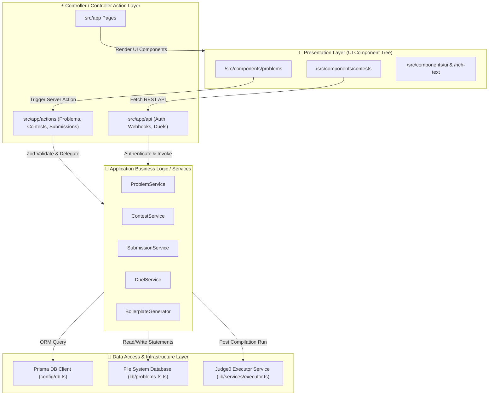

# 🏛️ Core System Architecture & Design Guidelines

This document provides a deep architectural walkthrough of the **Ummeed Platform Online Judge** system design, folder structure, module decoupling, data flows, and interview-ready engineering rationale.

---

## 🗺️ High-Level System Architecture



---

## 📂 Reorganized Folder Structure

The application's directory structure follows a clean separation of concerns matching modern corporate production patterns:

```
ummeed-platform/
├── prisma/                    # Schema migration setup and seed definitions
├── src/
│   ├── app/                   # Next.js App Router (Routing & Presenters)
│   │   ├── (admin)/           # Admin Route Group
│   │   ├── (protected)/       # Authenticated Route Group
│   │   ├── actions/           # Server Action Controllers (Presentation Controllers)
│   │   └── api/               # REST Endpoints
│   ├── config/                # Central Configuration Settings
│   │   └── db.ts              # Global Database Client setup
│   ├── components/            # UI Components Tree (Presentation Layer)
│   │   ├── admin/             # Admin Forms & Controls
│   │   ├── app-shell/         # Navbar, Sidebar, and App Shell Layouts
│   │   ├── problems/          # IDE, Boilerplate & Code Workspace Components
│   │   └── ui/                # Shared UI controls (e.g. Tab Panel, RichText)
│   ├── lib/                   # Internal Core Libraries & Business Logic
│   │   ├── auth/              # Complete Better-Auth Setup & Guards
│   │   ├── boilerplate/       # Code Generation Engines (Languages & signatures)
│   │   ├── services/          # Pure Business Logic Transaction Services
│   │   └── validation/        # Domain-Specific Zod Schemas
│   └── middleware.ts          # Authentication Route Protection Guard
```

---

## 📂 Directory & Core File Responsibilities

| Directory | Responsibility | Core Files |
| :--- | :--- | :--- |
| `src/config/` | Configures infrastructure connections, variables, and database client. | `db.ts` |
| `src/lib/auth/` | Controls session validation, routing guards, and configuration for better-auth. | `auth.ts`, `auth-utils.ts`, `auth-client.ts` |
| `src/lib/validation/` | Isolates validation rules per domain, preventing bloated files and schema coupling. | `problem.ts`, `contest.ts`, `submission.ts`, `shared.ts` |
| `src/lib/services/` | Contains the stateful business rules and workflows of the application. | `problem.ts`, `contest.ts`, `submission.ts`, `executor.ts`, `duel.ts` |
| `src/components/problems/` | Features interactive workspace views. Consolidates code compilers. | `code-workspace.tsx`, `submission-form.tsx` |

---

## 🔄 End-to-End Submission Request Flow

```mermaid
sequenceDiagram
    autonumber
    actor User as Student Developer
    participant CW as CodeWorkspace Component
    participant SA as Server Action (createSubmissionAction)
    participant SS as SubmissionService
    participant PS as PostgreSQL DB
    participant EX as Judge0Executor (Background)
    participant J0 as Judge0 Compiler API

    User->>CW: Write Code & Click Submit
    CW->>SA: Invoke Action (problemId, language, code)
    SA->>SA: Zod Validation (SubmissionCreateSchema)
    SA->>SS: Delegate createSubmission(userId, problemId, ...)
    SS->>PS: Create PENDING Submission Record
    SS->>>EX: Trigger Background Execution Run (Non-blocking)
    SS-->>SA: Return Submission Context
    SA-->>CW: Return Submission ID (Success)
    CW->>User: Redirect to Submissions Page (Polling Mode)

    Note over EX,J0: Execution starts in background thread
    EX->>EX: Wrap student code with testing harness
    EX->>J0: Send base64 payload POST /submissions?wait=true
    J0-->>EX: Return compilation output & test verdict
    EX->>PS: Update submission record status (COMPLETED, ACCEPTED/WA)
```

---

## 🎓 Interview Questions & Architectural Rationale

### 1. Why did you separate Services from Server Actions (Controllers)?
* **Answer**: Directing DB transactions and business workflows (like writing files or generating wrappers) inside Server Actions tightly couples the Presentation layer (HTTP actions) to the Data layer. By extracting logic into pure static Services (e.g. `ProblemService`), we ensure:
  1. **Reusability**: Problem creation logic can be triggered by a REST API endpoint, a gRPC service, or a CLI command, without copy-pasting code.
  2. **Testability**: Services can be unit-tested in isolation by mocking the database connection, without setting up mock HTTP contexts.
  3. **Transactional Safety**: Database rollbacks and filesystem operations are encapsulated in a single transaction boundary (`ProblemService.createProblem`).

### 2. How did you reduce code duplication in the editor workspace?
* **Answer**: Previously, standard code execution (`submission-form.tsx`) and contest submissions (`contest-submission-form.tsx`) had separate, bloated components duplicating localStorage autosaving, line gutter count algorithms, result display templates, and terminal outputs. 
* I decoupled the presentation layer from the execution API endpoints by creating a **Unified `CodeWorkspace` component**. It receives execution actions as parameter callbacks (`onRun`, `onSubmit`). The standard and contest forms now act as thin dependency wrappers passing the correct actions. This removed hundreds of duplicated lines and isolated presentation from routing structure.

### 3. What alternatives did you consider for compiling student code, and why Judge0?
* **Answer**: We considered running compilation on the Next.js server instances using Node's `child_process` execution. However:
  1. **Security risk**: Running untrusted student code directly on the application server could lead to remote code execution (RCE) vulnerabilities.
  2. **Performance block**: Compilation uses massive CPU/memory resources, which would choke main application threads.
  3. **Isolation**: Judge0 runs executions inside sandboxed Docker containers with memory thresholds, time limits, and restricted system permissions, keeping the host server safe and resilient.

### 4. How would you scale this architecture to support 100x more submissions?
* **Answer**:
  1. **Message Queue Integration**: Instead of firing immediate asynchronous runs via `submissionExecutor.execute(id)` which blocks Node server processes, we would introduce a dedicated message queue (e.g., RabbitMQ or Amazon SQS). Submissions would be placed in the queue, and a cluster of auto-scaling worker nodes would consume and process them.
  2. **Caching**: We would place a Redis caching layer in front of PostgreSQL to cache problem descriptions and testcase lookups.
  3. **Database Replices**: Utilize PostgreSQL Read Replicas to route read-heavy traffic (Contests list, dashboards, submissions history) away from the write-heavy master database.
