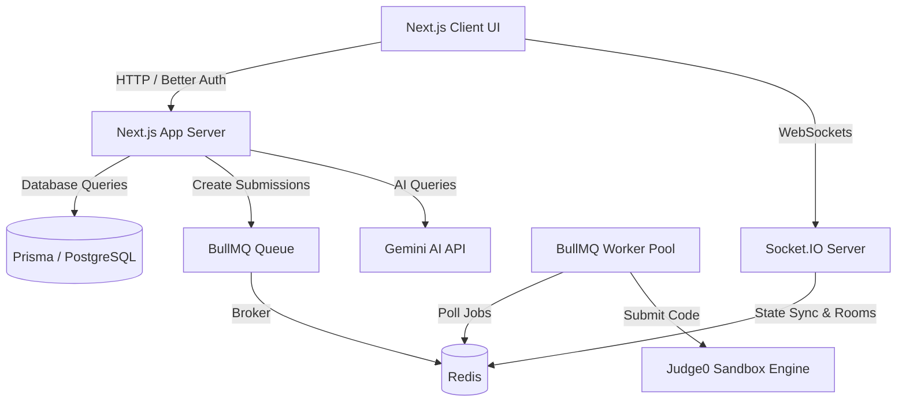
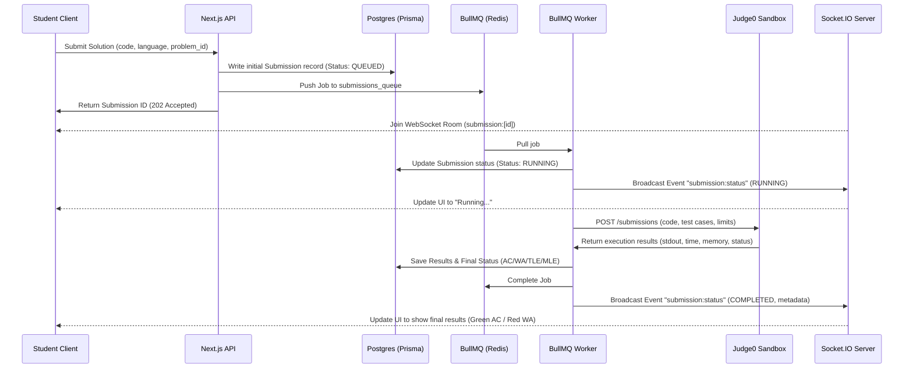

# AI-Native Competitive Programming Platform — Engineering Roadmap

This document serves as the implementation roadmap for building a production-grade, AI-native Competitive Programming Platform designed for 50–60 active students. The architecture prioritizes performance, horizontal scaling, real-time interactivity, and isolated code execution.

---

## Architectural Overview

Below is the proposed system design depicting how the key technologies interact:



### Proposed Submission Lifecycle



---

## Engineering Roadmap Timeline

```mermaid
gantt
    title Engineering Implementation Timeline
    dateFormat  YYYY-MM-DD
    section Core Infrastructure
    M1: Auth & Database Setup     :active, m1, 2026-07-06, 7d
    M2: Code Execution Engine     : m2, after m1, 10d
    M3: Real-Time Engine (WS)     : m3, after m2, 7d
    section Contests & Features
    M4: Contests & Leaderboard    : m4, after m3, 10d
    M5: AI Copilot Suite          : m5, after m4, 12d
    M6: 1v1 Duel Engine           : m6, after m5, 8d
    section Production & Scale
    M7: Prod Hardening & Deploy   : m7, after m6, 8d
```

---

## User Review Required

> [!IMPORTANT]
> **WebSockets Hosting Pattern**: Since Socket.IO requires persistent connections, it cannot run on standard serverless environments (e.g., Vercel) without a dedicated custom server wrapper. We propose hosting the Next.js API & Socket.IO server as a combined standalone Node.js process inside Docker, or running a separate small Node/Express server for WebSockets that shares Redis state.
> 
> **Judge0 Execution Policy**: Running Judge0 locally requires setting strict memory/CPU limits in the Docker Compose setup to prevent student submissions from exhausting host resources.

---

## Open Questions

> [!WARNING]
> 1. **AI Cost Management**: Should we implement a token budget (e.g., daily credits) per student for AI features (Hint Generator, Mock Interview) to prevent API rate limiting and cost overruns?
> 2. **Authentication Method**: Does the target environment support OAuth (GitHub/Google login) or should we strictly rely on credentials authentication (Email/Password) pre-seeded/imported from a student roster?

---

## Proposed Milestones

### Milestone 1: Project Bootstrap & Authentication Core
* **Goal**: Establish the local development environment, database migrations, and a production-grade authentication flow.
* **Features**:
  - Next.js 15 template setup with TypeScript, ESLint, Prettier, TailwindCSS, and shadcn/ui.
  - Docker Compose for local PostgreSQL and Redis services.
  - Prisma schema definitions for basic entities: `User`, `Problem`, `Submission`, `Contest`.
  - Better Auth integration matching database sessions using the Prisma adapter.
  - Basic dashboard shell and user profiles.
* **Dependencies**:
  - Node.js, Docker, Prisma, Better Auth, PostgreSQL, Redis.
* **Risks**:
  - Next.js 15 App Router compatibility with external auth middlewares.
  - *Mitigation*: Implement standard Better Auth handlers inside Route Handlers (`app/api/auth/[...better-auth]/route.ts`).
* **Deliverables**:
  - Completed Docker Compose config for local DB and Redis.
  - Configured auth routes with social & credentials provider logins.
  - Seed script to populate mock problems and users.

---

### Milestone 2: Code Execution Engine (Judge0 & BullMQ)
* **Goal**: Build an asynchronous, secure code compilation and sandbox execution pipeline.
* **Features**:
  - Local Judge0 integration inside Docker Compose (running backend, DB, and sandbox workers).
  - Admin dashboard to create, read, update, and delete problems, specifying memory/CPU limits and private test suites.
  - Submission endpoint that accepts user code, persists state to Postgres, and dispatches compilation jobs.
  - BullMQ queue workers that poll submission jobs, dispatch tasks to the Judge0 REST API, parse execution statistics, and write results back to the database.
* **Dependencies**:
  - BullMQ, Redis, Judge0.
* **Risks**:
  - Submissions flooding the queue causing high latency or freezing the server.
  - *Mitigation*: Limit worker concurrency and configure execution timeouts in BullMQ. Set absolute resource caps on the Judge0 Docker containers.
* **Deliverables**:
  - Healthy Judge0 setup running in local containers.
  - Asynchronous BullMQ background worker system executing code in C++, Java, Python, and JavaScript.
  - Admin panel for problem creation (including test-case uploading).

---

### Milestone 3: Real-Time Event & WebSockets Engine (Socket.IO)
* **Goal**: Enable real-time notifications, status updates, and interactive feedback loops for users.
* **Features**:
  - Socket.IO server integrated with Redis Pub/Sub adapter to allow horizontal scaling.
  - Real-time client-side hooks to subscribe to room-based channels (e.g., `submission:[id]`, `contest:[id]`).
  - Active submission status streaming (updates from *Queued* -> *Running on Test Case N* -> *Accepted/Wrong Answer*).
* **Dependencies**:
  - Socket.IO, Redis.
* **Risks**:
  - Connection leaks or unauthenticated client sockets accessing private submissions/contests.
  - *Mitigation*: Authenticate socket handshakes using Better Auth session cookies/tokens and validate user permissions prior to joining rooms.
* **Deliverables**:
  - Standardized WebSocket server structure.
  - Real-time compilation status dashboard displaying execution state as it happens.

---

### Milestone 4: Contests Engine & Caching Leaderboard
* **Goal**: Build a secure platform module to schedule contests, enforce contest boundaries, and calculate live rankings.
* **Features**:
  - Contest scheduler and registration portal.
  - Strict contest state machine: *Scheduled* -> *Active* -> *Concluded*. Enforces code access only during active windows.
  - Virtual contest capability allowing individuals to take past contests with synchronized timer offsets.
  - Real-time leaderboard using Redis Sorted Sets (`ZADD`, `ZINCRBY`, `ZREVRANGE`) to process points/penalties instantaneously.
* **Dependencies**:
  - Redis Sorted Sets, Socket.IO.
* **Risks**:
  - High database read-write amplification during contest start/end spikes.
  - *Mitigation*: Cache the current standings in Redis and write results to PostgreSQL lazily or in batches, bypassing direct database reads for leaderboard rendering.
* **Deliverables**:
  - Real-time rendering leaderboard UI.
  - Active contest dashboard locking down regular features when a contest is active.

---

### Milestone 5: AI-Native Copilot Suite
* **Goal**: Introduce AI-driven learning tools using state-of-the-art Large Language Models.
* **Features**:
  - **AI Hint Generator**: Scans the user's incorrect submission, runtime logs, and test case failures to generate multi-tier, progressive hints without spoiling code solutions.
  - **Contest Copilot**: Interactive chat assistant available *only* in practice mode for code reviews, time/space complexity optimization, and syntax help.
  - **AI Mock Interview**: Interactive whiteboard mode where an AI agent acts as a technical interviewer, dynamically analyzing code inputs and prompting standard follow-up questions.
* **Dependencies**:
  - LLM Provider API (e.g., Google Gemini SDK), Prompt Engineering Templates.
* **Risks**:
  - High latency of API calls degrading user experience; students abusing prompts to cheat.
  - *Mitigation*: Stream response chunks to the UI in real-time. System-prompt LLMs to reject direct solution requests and strictly restrict AI interactions during active contests.
* **Deliverables**:
  - Prompt templates and server-side LLM router service.
  - Hint modal UI component.
  - Live AI text/voice mock interview playground interface.

---

### Milestone 6: Gamified 1v1 Duel Engine
* **Goal**: Create an engaging, competitive multiplayer lobby where students can challenge peers to speed-coding duels.
* **Features**:
  - Matchmaking queue powered by Redis lists to match online students with similar Elo ratings.
  - Real-time duel interface: side-by-side progression indicators showing compiler errors or test case progress.
  - Custom matchmaking rooms allowing invite-only links.
  - Post-match Elo scoring updates based on execution speed and correctness.
* **Dependencies**:
  - Elo calculation helpers, Socket.IO Rooms.
* **Risks**:
  - Matchmaking starvation with a small user base of 50-60 students.
  - *Mitigation*: Introduce "AI Bots" simulating student behaviors or relax matchmaking thresholds after 30 seconds of waiting.
* **Deliverables**:
  - Duel matchmaking lobby.
  - Split-screen coding battle arena with live opponent status tracking.

---

### Milestone 7: Production Engineering, Security, & Scaling
* **Goal**: Prepare the platform for reliable deployment, guard against cheating, and monitor application health.
* **Features**:
  - **Rate Limiting**: IP-based and user-based request throttling using Redis Token Bucket.
  - **Plagiarism Checker**: Integrates an AST-based parser or code similarity checking script (e.g., MOSS-like algorithm) to screen submissions.
  - **Contest Integrity Shield**: Front-end detector monitoring window focus/tab switching and preventing copy-paste within active contest tabs.
  - **Horizontal Scale-Out**: Separate Docker Compose configuration scaling BullMQ execution workers.
  - **Telemetry**: Prometheus/Grafana or basic instrumentation tracking CPU, queue length, database connection pool, and error occurrences.
* **Dependencies**:
  - Docker Compose (Production Profile), Prometheus, Grafana, Sentry.
* **Risks**:
  - Host server overload during heavy concurrent compilations.
  - *Mitigation*: Implement automatic queue throttling and deploy Judge0 workers on separate VM instances if necessary.
* **Deliverables**:
  - Production-ready Docker Swarm / Compose setup.
  - Monitoring dashboards showing system vitals.
  - Security audit checklist (CORS, JWT rotations, environment variable isolation).

---

## Verification Plan

### Automated Tests
- Integration tests using Vitest to verify API routers and auth middleware.
- Stress testing of Queue processing using dynamic mock worker tasks.
- Simulation test script simulating 60 concurrent user submits to measure processing latency and resource utilization.

### Manual Verification
- Deploy the dockerized platform to a staging machine.
- Verify real-time updates by initiating dual connections from distinct browser sessions.
- Trigger AI hints on incorrect solutions to verify instructions are followed without direct code exposure.
