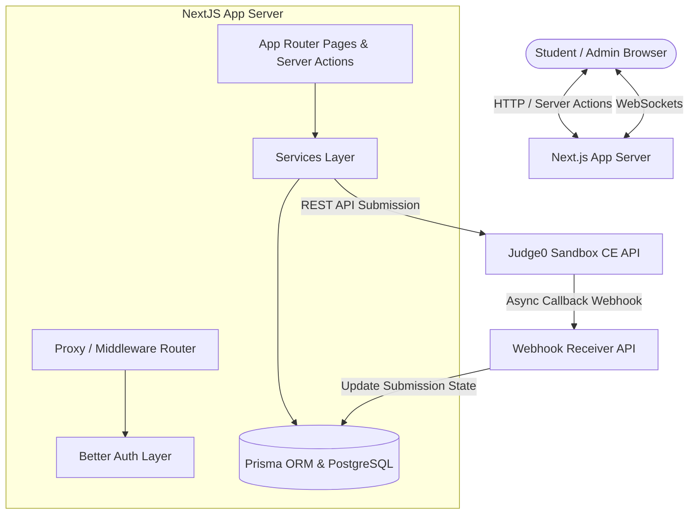

# Umeed Coding Platform — Comprehensive Project Learning Guide

Welcome to the definitive learning guide for the **Umeed Coding Platform**. Understanding a codebase of this scale requires looking past the raw lines of code and understanding the **architectural patterns**, **design trade-offs**, and **information flow**.

This guide is structured to help you master this system from the ground up, so you can confidently explain it, debug it, and present it to other developers or interviewers.

---

## 1. Explanation Methodology (How We Will Learn)

To learn this project effectively, we will follow the **"Outside-In" Pedagogical Method**:
1.  **High-Level Vision**: What problem does this system solve, and what is its macro architecture?
2.  **Core Flow Analysis**: How does data move through the system when a user registers, starts a contest, runs code, or plays a 1v1 duel?
3.  **Architectural Decisions Audit**: Why did we choose specific technologies, and what alternatives did we reject?
4.  **Module-by-Module Code walkthrough**: Deep-diving into the directories to understand exactly what each file does.
5.  **Technical Concept Checklist**: The theoretical engineering concepts you need to master to explain the project.

---

## 2. High-Level System Architecture

Umeed is a modern, full-stack **Online Judge and Competitive Programming platform** built using a unified TypeScript stack. 

Here is the block-diagram representation of the architecture:

### The Three Core Layers:
1.  **Client Layer (UI)**: Next.js Client Components styled with CSS variables (light mode default, custom green branding tokens) providing real-time code workspaces, contest dashboards, and interactive lobbies.
2.  **App/Service Layer (Backend)**: Next.js App Router acting as the backend API and Server Action coordinator. It manages authorization, queries the database, generates boilerplate code, wraps student submissions, and talks to the code execution sandbox.
3.  **Execution Layer (Sandbox)**: A dedicated, isolated sandbox API (**Judge0**) that compiles and executes user code inside secure Docker containers under strict time and memory limits.

---

## 3. Key Design Decisions & Rationale ("Why" Decisions)

When explaining this project, you will frequently be asked: *"Why did you build it this way?"* Here are the answers:

| Decision | What we chose | Why we chose it (Rationale) | Alternatives Considered |
| :--- | :--- | :--- | :--- |
| **Framework** | **Next.js 16 (App Router)** | Single-repo developer velocity. Fast SSR (Server-Side Rendering) for static problem statement SEO, and Server Actions for secure database calls without setting up a separate Express server. | Express.js + React SPA (rejected: increases complexity, requires maintaining two separate hosting configurations). |
| **Authentication** | **Better Auth** | Standardized, secure authentication. Handles cookie management, session storage, and route authorization helpers natively. Saves weeks of security auditing. | Auth0 / NextAuth (rejected: NextAuth is historically buggy with complex configurations; Better Auth offers cleaner TypeScript integrations). |
| **Database ORM** | **Prisma ORM** | Type-safe database queries. Generates TypeScript typings automatically from the database schema, making it impossible to query a non-existent column. | Raw SQL / Sequelize (rejected: prone to runtime bugs and lack of compile-time type checking). |
| **Code Execution** | **Judge0 CE API** | Production-ready compilation sandbox. Running student code directly on our server is a massive security risk (remote code execution). Judge0 runs code inside sandboxed containers with strict memory/time bounds. | Writing a custom Docker runner script (rejected: high maintenance, security risks, hard to scale). |
| **State Sync** | **PM2 Process Manager** | Keeps the Next.js process running forever in the background on EC2, handles automatic restarts on server crashes, and manages environment variables cleanly. | Systemd / Docker (rejected: PM2 is lightweight and simple to debug for single-node deployments). |

---

## 4. Codebase Navigation (File-by-File Walkthrough)

Here is how the project files are laid out under `ummeed-platform/` and what they do:

### A. Configuration & Database Layer
*   [`src/config/db.ts`](file:///c:/Users/saura/Desktop/Online_Judge_project/ummeed-platform/src/config/db.ts): Instantiates the global **PrismaClient** instance. Reuses the connection across hot reloads in development to prevent database connection leaks.
*   [`prisma/schema.prisma`](file:///c:/Users/saura/Desktop/Online_Judge_project/ummeed-platform/prisma/schema.prisma): The absolute source of truth for the database layout. Defines tables like `User`, `Problem`, `Submission`, `Contest`, and `DuelRoom`.

### B. Authentication & Middleware
*   [`src/lib/auth/auth.ts`](file:///c:/Users/saura/Desktop/Online_Judge_project/ummeed-platform/src/lib/auth/auth.ts): Instantiates the Better Auth backend config. Sets up database adapter links.
*   [`src/lib/auth/auth-client.ts`](file:///c:/Users/saura/Desktop/Online_Judge_project/ummeed-platform/src/lib/auth/auth-client.ts): Client-side authentication helpers (login, signup, logout) for use in React client components.
*   [`src/lib/auth/auth-utils.ts`](file:///c:/Users/saura/Desktop/Online_Judge_project/ummeed-platform/src/lib/auth/auth-utils.ts): Server-side helper functions:
    *   `getCurrentUser()`: Fetches user details from request cookies securely.
    *   `requireAuth()` / `requireAdmin()`: Validates roles and redirects unauthorized users.
*   [`src/middleware.ts`](file:///c:/Users/saura/Desktop/Online_Judge_project/ummeed-platform/src/middleware.ts): Next.js proxy route interceptor. Blocks access to protected pages (`/dashboard`, `/problems`, `/admin`) if session cookies are missing.

### C. Services Layer (Business Logic)
This folder isolates the core operations of the application:
*   [`src/lib/services/executor.ts`](file:///c:/Users/saura/Desktop/Online_Judge_project/ummeed-platform/src/lib/services/executor.ts): Interfaces with the **Judge0 API**. Prepares payload parameters, pushes submissions, and tracks execution states.
*   [`src/lib/services/wrapper.ts`](file:///c:/Users/saura/Desktop/Online_Judge_project/ummeed-platform/src/lib/services/wrapper.ts): The code wrapping engine. Grabs student solutions and injects them into custom boilerplate execution wrappers so inputs/outputs map correctly.
*   [`src/lib/services/contest.ts`](file:///c:/Users/saura/Desktop/Online_Judge_project/ummeed-platform/src/lib/services/contest.ts): Queries and registers contests, updates leaderboards, and handles registrations.

### D. Server Actions (The Backend Entrypoints)
*   [`src/app/actions/submissions.ts`](file:///c:/Users/saura/Desktop/Online_Judge_project/ummeed-platform/src/app/actions/submissions.ts): Coordinates code runs and submissions:
    *   `runCodeAction`: Fetches the first 2 test cases, sends code to Judge0, parses outputs, and returns testcase results.
    *   `createSubmissionAction`: Saves the submission in the database, submits it to Judge0 for full evaluation, and returns a token.
*   [`src/app/actions/admin-auth.ts`](file:///c:/Users/saura/Desktop/Online_Judge_project/ummeed-platform/src/app/actions/admin-auth.ts): Handles Admin Dashboard login. Sets the `admin_session` cookie to bypass student views.

### E. Frontend Components (The UI Layouts)
*   [`src/app/globals.css`](file:///c:/Users/saura/Desktop/Online_Judge_project/ummeed-platform/src/app/globals.css): Global styles, variables, typography, animations, utility classes, and custom green brand identity parameters.
*   [`src/components/app-shell/navbar.tsx`](file:///c:/Users/saura/Desktop/Online_Judge_project/ummeed-platform/src/components/app-shell/navbar.tsx) & [`sidebar.tsx`](file:///c:/Users/saura/Desktop/Online_Judge_project/ummeed-platform/src/components/app-shell/sidebar.tsx): Responsive application navigation templates. Adapt dynamically to Student and Admin view states.
*   [`src/components/problems/submission-form.tsx`](file:///c:/Users/saura/Desktop/Online_Judge_project/ummeed-platform/src/components/problems/submission-form.tsx): The code workspace panel. Contains the code editor text area, language selector dropdown, and the structured "Run Code" testcase output panel.

---

## 5. Key Concept Checklist (Things to Learn)

To explain this project fluently, you must understand these core web development terms:

### 1. Cookies & Session Management
*   **What it is**: Small text files saved by browsers.
*   **Role in this project**: Better Auth and our admin auth store cookies (`admin_session`) in the browser. On every page load, Next.js checks these cookies to verify if you are logged in.
*   **The "Secure" Cookie Flag**: If `secure: true`, the browser only transmits the cookie over HTTPS. Since our staging environment uses HTTP, we set `secure: false` so logins work on the EC2 IP address.

### 2. Sandbox Code Execution (REST APIs & Webhooks)
*   **What it is**: Isolating running programs so they can't harm the system.
*   **How it works in Umeed**:
    1.  Student clicks **Submit**. Next.js writes a `Submission` in the DB as `PENDING`.
    2.  Next.js makes an HTTP POST request to Judge0 with the code.
    3.  Judge0 executes it in an isolated container.
    4.  Instead of holding the request open (which would block the server), Judge0 calls our **Webhook endpoint** (`/api/webhooks/judge0`) once the evaluation is done.
    5.  Our webhook receiver updates the database status to `ACCEPTED` or `WRONG_ANSWER`.

### 3. Database Transactions
*   **What it is**: Executing multiple database statements as a single atomic block. If one fails, all of them roll back, preventing data corruption.
*   **Why we use it**: Updating scores in a contest leaderboard. When a student gets a problem right, we must update the submission record *and* increment their contest score. If either fails, we roll back to prevent incorrect scores.

### 4. Websockets (1v1 Duels Lobbies)
*   **What it is**: A persistent, bidirectional communication link between browser and server (unlike HTTP, which is request-and-response).
*   **Why we use it**: Matchmaking and 1v1 duels. Allows the server to push match status immediately to the client when a matching opponent joins the queue.

---

## 6. Where We Go Next

This guide serves as our overall study map. To proceed:
1.  We can focus on a **single flow** (e.g., "Walk me through how a student clicks 'Submit' and how Judge0 processes it").
2.  We can review the **database design** (looking at `schema.prisma`).
3.  We can dive into a **particular file** of your choice.

Which section or flow would you like to review first?
