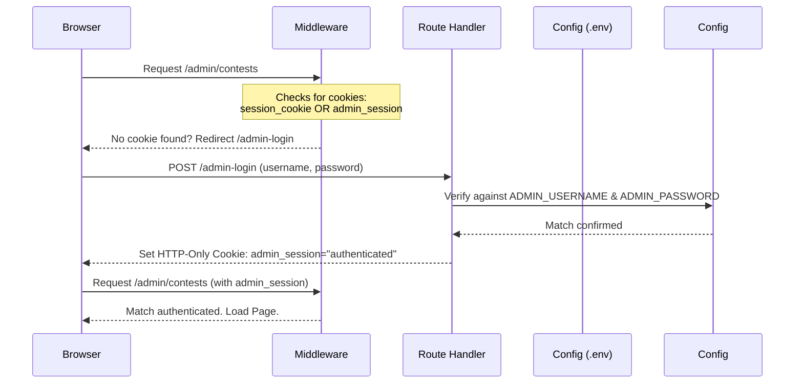

# Technical Walkthrough - Dedicated Admin Login Bypass & Contest Management Subsystem

This document explains the architecture, security mechanism, and implementation details of the Dedicated Admin Login Bypass and the Contest Management Subsystem.

---

## 1. Dedicated Admin Login Bypass Architecture

To enable administration access without database accounts or public signup capabilities, we built an environment-backed credentials bypass.

### Authentication Flow Diagram


### Key Components

#### Environment Config
The credentials are kept securely in the environment at `.env`:
```env
ADMIN_USERNAME="admin"
ADMIN_PASSWORD="super_secure_admin_password_123!"
```

#### Middleware Route Guards
Located in [middleware.ts](file:///Users/anshrajdhakad/Scripts/01_Projects/coding_platform/Online_Judge_project/ummeed-platform/src/middleware.ts):
- Evaluates if the path is a protected administrative route (`/admin` or `/admin/:path*`).
- Bypasses standard authentication redirects if the `admin_session` cookie is set to `"authenticated"`.
- Separates `/admin-login` from wildcard matches to avoid infinite redirect loops:
  ```typescript
  const isProtectedRoute =
    request.nextUrl.pathname.startsWith("/dashboard") ||
    request.nextUrl.pathname.startsWith("/submissions") ||
    request.nextUrl.pathname === "/admin" ||
    request.nextUrl.pathname.startsWith("/admin/") ||
    request.nextUrl.pathname.startsWith("/problems") ||
    request.nextUrl.pathname.startsWith("/contests") ||
    request.nextUrl.pathname.startsWith("/leaderboard");
  ```
- Redirects authenticated admin users attempting to access public auth paths (`/login`, `/signup`, `/admin-login`) to `/admin`.

#### Admin Authentication Action
Located in [admin-auth.ts](file:///Users/anshrajdhakad/Scripts/01_Projects/coding_platform/Online_Judge_project/ummeed-platform/src/app/actions/admin-auth.ts):
- `loginAdminAction`: Validates credentials from the form against process environment variables. If valid, writes an HTTP-only, secure cookie named `admin_session` set to `"authenticated"`.
- `logoutAdminAction`: Deletes the `admin_session` cookie.

#### Server Bypass Injector
Located in [auth-utils.ts](file:///Users/anshrajdhakad/Scripts/01_Projects/coding_platform/Online_Judge_project/ummeed-platform/src/lib/auth-utils.ts):
- Checks for the `admin_session` cookie. If valid, immediately returns a mock admin user structure:
  ```typescript
  export async function requireAdmin() {
    const cookieStore = await cookies();
    const adminSession = cookieStore.get("admin_session");

    if (adminSession && adminSession.value === "authenticated") {
      return {
        id: "admin-system-bypass",
        name: "System Administrator",
        email: "admin@ummeed.org",
        emailVerified: true,
        image: null,
        role: "ADMIN" as const,
        rating: 3000,
        createdAt: new Date(),
        updatedAt: new Date(),
      };
    }
    // Fallback to standard DB authentication check
  }
  ```

---

## 2. Contest Management Subsystem

The contest subsystem allows administrators to draft, schedule, publish, and link programming problems to live contest timelines.

### Data Models
Defined in [schema.prisma](file:///Users/anshrajdhakad/Scripts/01_Projects/coding_platform/Online_Judge_project/ummeed-platform/prisma/schema.prisma):
- `Contest`: Contains title, description, start time, end time, publication status, and `status` (`UPCOMING`, `RUNNING`, `ENDED`).
- `ContestProblem`: Join model linking `Contest` to `Problem` with specific metadata:
  - `points`: Custom point score weight for the problem in the contest.
  - `sequence`: Integer mapping sequence ordering (e.g. 0 ➔ A, 1 ➔ B, 2 ➔ C).

### Validation Schema
Located in [validation.ts](file:///Users/anshrajdhakad/Scripts/01_Projects/coding_platform/Online_Judge_project/ummeed-platform/src/lib/validation.ts):
```typescript
export const ContestProblemFormSchema = z.object({
  problemId: z.string().uuid(),
  points: z.number().int().positive().default(100),
  sequence: z.number().int().nonnegative(),
});

export const ContestFormSchema = z.object({
  title: z.string().min(3).max(100),
  description: z.string().optional().nullable(),
  startTime: z.coerce.date(),
  endTime: z.coerce.date(),
  published: z.boolean().default(false),
  problems: z.array(ContestProblemFormSchema).default([]),
}).refine((data) => data.endTime > data.startTime, {
  message: "End time must be after start time",
  path: ["endTime"],
});
```

### Server Actions
Located in [contests.ts](file:///Users/anshrajdhakad/Scripts/01_Projects/coding_platform/Online_Judge_project/ummeed-platform/src/app/actions/contests.ts):
- `createContestAction`: Parses and saves metadata, then maps and inserts problem relations.
- `updateContestAction`: Runs inside a database transaction (`prisma.$transaction`) to safely clear previous relations and insert updated ones.
- `deleteContestAction`: Deletes the contest (relational cascading rules handle cleanup).

### UI Pages
Located under `src/app/(admin)/admin/contests/`:
- `page.tsx`: Table listing existing contests, timelines, status indicators, and problem counts.
- `new/page.tsx` & `[id]/edit/page.tsx`: Route entry points that feed available database problems to the form wrapper.
- `src/components/admin/contest-form.tsx`: Handles dynamic problem inclusion, letters sequence generation (A, B, C), points selection, date-string conversions, and submission.
