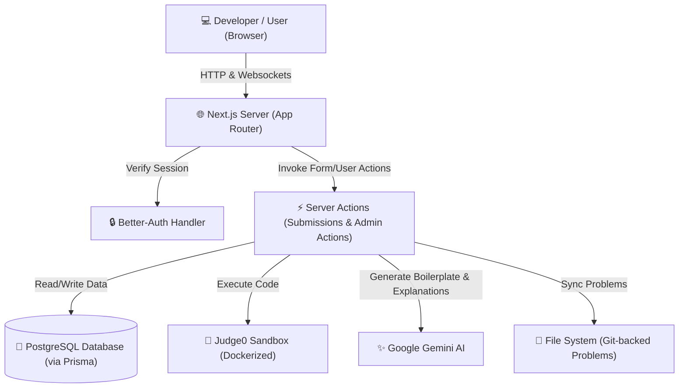

# 🚀 Ummeed Platform - Git-Backed Online Judge

An interview-ready, production-grade **Online Judge & Coding Arena** built using **Next.js 16 (React 19)**, **Prisma ORM**, **Better-Auth**, **Tailwind CSS 4**, and **Judge0** for sandboxed code execution, integrated with **Google Gemini AI** for boilerplate generation and hints.

---

## 🗺️ System Architecture



---

## ✨ Features

- **🔐 Robust Auth**: Complete user and admin session management using `better-auth`.
- **🏆 Contest Module**: Real-time contest creation, registration, scoring, and dynamic live Leaderboards.
- **⚔️ Coding Duels**: Head-to-head programming challenges with interactive matchmaking.
- **🖥️ Workspace**: Feature-rich IDE code workspace supporting multiple language runtimes, test case submissions, status polling, and execution logs.
- **🧠 AI Co-Pilot**: Automated code boilerplate generation and intelligent logic hints/explanations powered by Google Gemini.
- **📦 Git-Backed Problems**: Problem definitions, constraints, test cases (`.in` / `.out`), and samples managed directly in the filesystem under `/problems`.

---

## 📂 Directory Structure

```
.
├── docs/                      # Architectural plans, specifications, and feature walkthroughs
│   ├── walkthroughs/          # Walkthroughs of individual platform features
│   └── *.md                   # System designs and implementation logs
├── problems/                  # Git-backed problems database
│   └── [problem-slug]/        # Individual problem configuration
│       ├── problem.json       # Metadata, examples, constraints, and testcase manifest
│       └── tests/             # Testcase inputs (.in) and expected outputs (.out)
└── ummeed-platform/           # Next.js Web Application
    ├── prisma/                # Database schema, seed data, and system utility scripts
    │   ├── schema.prisma      # Prisma database model relationships
    │   └── clear-live.ts      # Automated database purge script for production setup
    ├── src/
    │   ├── app/               # App Router pages and Server Actions
    │   │   ├── (admin)/       # Authorized admin panels & dashboards
    │   │   ├── (protected)/   # Contests, leaderboards, submissions, and profile dashboard
    │   │   ├── actions/       # Server Actions handling logic
    │   │   └── api/           # Backend REST API routes
    │   ├── components/        # Reusable UI, App Shell, & Workspace components
    │   └── lib/               # Shared services, validation schemas, and helpers
    ├── docker-compose.yml     # Local services deployment (PostgreSQL, Redis, Judge0)
    └── package.json           # Application dependencies
```

---

## 🛠️ Tech Stack

- **Framework**: [Next.js 16 (App Router)](https://nextjs.org/)
- **Language**: [TypeScript](https://www.typescriptlang.org/)
- **Database ORM**: [Prisma](https://www.prisma.io/) with PostgreSQL
- **Authentication**: [Better-Auth](https://www.better-auth.com/)
- **Styles**: [Tailwind CSS v4](https://tailwindcss.com/)
- **Execution Sandbox**: [Judge0 CE](https://judge0.com/)
- **AI Integrations**: [Google Gen AI SDK](https://github.com/google/generative-ai-js)

---

## 🚀 Quick Start Guide

### 1. Prerequisites
- Docker & Docker Compose
- Node.js (v20+)
- pnpm (recommended)

### 2. Clone and Setup Environment
Copy the environment template and configure your secrets:
```bash
cd ummeed-platform
cp .env.example .env # Set up database urls, auth secrets, Gemini API key, and Judge0 endpoints
```

### 3. Spin Up Infrastructure
Start the database, Redis, and Judge0 compiler instances:
```bash
docker-compose up -d
```

### 4. Database Setup & Seed
Generate Prisma Client, push schema tables, and populate seed data (including problem sync):
```bash
npx prisma db push
npx prisma db seed
```

### 5. Start Development Server
```bash
pnpm install
pnpm dev
```
Open `http://localhost:3000` to interact with the platform.

---

## 🧹 Database Cleanup Script

For demonstration or deployment resets, run the database purger to clear all test submission runs, duel histories, and non-admin accounts:
```bash
npx tsx prisma/clear-live.ts
```
